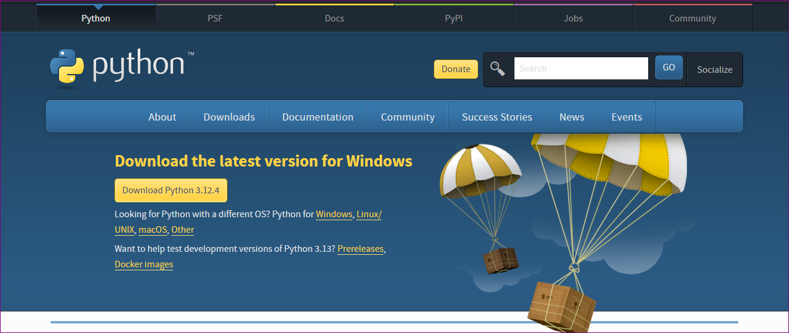
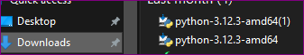
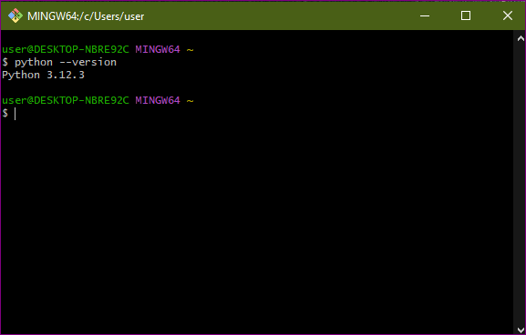
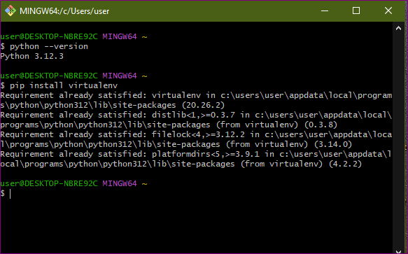

[](https://classroom.github.com/a/WfNmjXUk)
[](https://classroom.github.com/online_ide?assignment_repo_id=15292055&assignment_repo_type=AssignmentRepo)
# SE-Assignment-6
 Assignment: Introduction to Python
Instructions:
Answer the following questions based on your understanding of Python programming. Provide detailed explanations and examples where appropriate.

 Questions:

1. Python Basics:
   - What is Python, and what are some of its key features that make it popular among developers? Provide examples of use cases where Python is particularly effective.
      python is a programming language that is popular due to its simplicity, readability and versatility.
      key features of python;
         a. cross-platform compatibility.
         b. easy-to-tlearn syntax.
         c. dynamic typing.
         d. large standard library.
      examples of use cases where python is particullarly effective;
         a. web development.
         b. automation.
         c. data analysis
         


2. Installing Python:
   - Describe the steps to install Python on your operating system (Windows, macOS, or Linux). Include how to verify the installation and set up a virtual environment.
      step1.copy the link  http://wwww.python.org and go to your browser as shown
   
   step 2. download python to your laptop for windows and go to your downloads and search for python as shown
   
   step 3. install python in your laptop
   step 4.nstalling Python Compilers and Runtimes:
   the python compiler and interpreter come hand i handy with the python package and so there is no need of installing python compilers and interpreters separately. this is ensured by opening the command prompy or git and then type "python --version" . as shown
   
    step 5. Install a virtual environment using pip install virtualenv as shown
    
    step 6. Activate the virtual environment using source myenv\Scripts\activate.


3. Python Syntax and Semantics:
   - Write a simple Python program that prints "Hello, World!" to the console. Explain the basic syntax elements used in the program.
      print("Hello, World!")
      The basic syntax elements are;
         a. the print() function, which prints its argument to the console.
         b. The string literal "Hello, World!", which is enclosed in quotes.


4. Data Types and Variables:
   - List and describe the basic data types in Python. Write a short script that demonstrates how to create and use variables of different data types.
       basic data types of python include;
         a. integers- used to enter numbers in python eg 8.
         b. floating point- used to enter decimal numbers  eg 8.4.
         c. string- used to write characters eg valary.
         d. list- used to list a number of items.
         e. boolean values - returns true or false.
      short script that demonstrates how to create and use variables of different data types;
         # integer
           y = 5
         # floating point 
          x = 5.5
         # string   
         name = valary
         # boolean 
          5>10 = false

         print(y)
         print(x)
         print(name)
         print(5>10)

         output =5
         output =5.5
         output =valary
         output =false


5. Control Structures:
   - Explain the use of conditional statements and loops in Python. Provide examples of an `if-else` statement and a `for` loop.
       contiditional statements are used in the case where there are two more conditions to be executed eg  if-else statement.
      loops are used when a condition is reccuring  eg the for loop.
          example of if-else statement;
            x = 10
            if x > 100:
                print("x is greater than 100")
            else:
               print("x is less than or equal to 100")
        
          example of for loop;
            colors = ["red", "brown", "green"]
            for color in colors:
                print(color)


6. Functions in Python:
   - What are functions in Python, and why are they useful? Write a Python function that takes two arguments and returns their sum. Include an example of how to call this function.
      a function is a block of code that can be called multiple tgimes from different parts of a program.
      functions are useful as they can be reused and modularized in a program.
      example of a function that takes twon arguments and returns their sum;
         def add(a, b):
            return a + b

         result = add(5, 6)
         print(result)  
         output = 11

7. Lists and Dictionaries:
   - Describe the differences between lists and dictionaries in Python. Write a script that creates a list of numbers and a dictionary with some key-value pairs, then demonstrates basic operations on both.
      lists are ordered collections of items that can contain duplicates while dictionaries are unordered collections of key-value pairs.
      example of a list of numbers and a dictionary
         my_list = [10, 20, 30, 40, 50]
         my_dict = {"name": "valary", "age": 21}

         print(my_list)  # prints [1, 2, 3, 4, 5]
         print(my_dict)  # prints {"name": "valary", "age": 21}

       example of demonstrating basic operations on both:
         my_list.append(60)  
         my_dict["city"] = "Kenya"  

         print(my_list)  # prints [10, 20, 30, 40, 50, 60]
         print(my_dict)  # prints {"name": "valary", "age": 21, "city": "Kenya"}


8. Exception Handling:
   - What is exception handling in Python? Provide an example of how to use `try`, `except`, and `finally` blocks to handle errors in a Python script.
      Exception handling in Python allows you to catch and handle errors that occur during runtime.
      example of using `try`, `except`, and `finally` blocks
      try:
         y = int(input("Enter a number: "))
      except ValueError:
         print("Invalid input")
      finally:
         print("Goodbye!")

    

9. Modules and Packages:
   - Explain the concepts of modules and packages in Python. How can you import and use a module in your script? Provide an example using the `math` module.
      modules are those files that contain definitions for functions and variables while packages are collections of related modules.
      example of using 'math' module:
         import math

         result = math.sqrt(16)
         print(result)  # prints 4.0

    

10. File I/O:
    - How do you read from and write to files in Python? Write a script that reads the content of a file and prints it to the console, and another script that writes a list of strings to a file.
      
example of reading from a file:
```python
with open("example.txt", "r") as file:
    content = file.read()
print(content)  # prints the contents of the file

example of writing to a file:

with open("example.txt", "w") as file:
    file.write("Hello, World!\n")


# Submission Guidelines:
- Your answers should be well-structured, concise, and to the point.
- Provide code snippets or complete scripts where applicable.
- Cite any references or sources you use in your answers.
- Submit your completed assignment by [due date].


